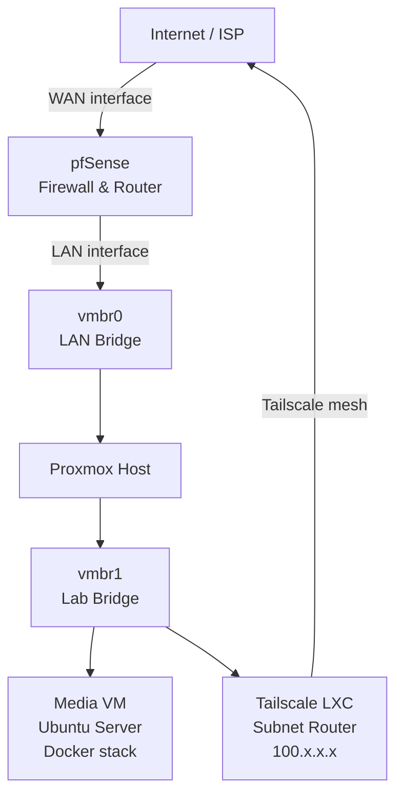

# Network Topology

Infrastructure as of April 2026. Built on Proxmox running on a MacBook 2015.

## Trust Zones

| Zone | Bridge | Purpose | Trust level |
|------|--------|---------|-------------|
| LAN | vmbr0 | Management, host access | High |
| Lab | vmbr1 | VMs and containers | Medium — isolated from LAN |
| VPN mesh | Tailscale | Remote access | Authenticated only |

## Traffic Flow — WAN to Media VM

1. Inbound request hits pfSense WAN interface
2. pfSense evaluates against stateful ruleset — default deny
3. Tailscale handles remote access: encrypted overlay, no open ports on WAN
4. Media VM is on vmbr1 — not directly reachable from LAN without explicit pfSense rule

## Why This Segmentation

vmbr1 is intentionally isolated from vmbr0. The media stack runs services with broad internet exposure (torrent client, indexers). Keeping it on a separate bridge means a compromise of the media VM does not give direct LAN access. pfSense is the single enforcement point for any cross-zone traffic.
